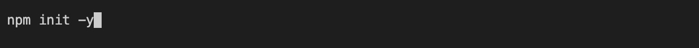
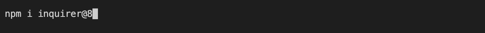
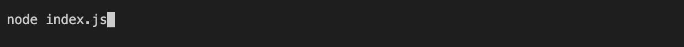

# README-generator

  
  ## Description
  This is a command line application that was designed to make the production of README files more streamline while still producing a professional level writeup.
  
  ## Table of Contents
  
  - [Installation](#installation)
  - [Usage](#usage)
  - [Credits](#credits)
  - [License](#license)
  - [Contributing](#contributing)
  - [Tests](#tests)
  - [Questions](#questions)
  
  ## Installation
  Clone README-generator repo from GitHub https://github.com/smariagomez/README-generator and then open that repo in your code editor. To install necessary dependencies run the following command: npm init -y. Then run the command: npm i inquirer@8.

  
  ## Usage
  Once the inquirer has been installed. Run the command node index.js. Once that step has been completed you will be led through a series of prompts where you will type in the requested information. Don’t forget to site this repo in the “credits” section. Once all of the questions/prompts have been responded to a README.md file will be generated in the output folder. Images will need to be stored in an assets folder with appropriate <src> pathway manually typed into the README.md file. Once that step has been completed, copy the contents of the README.md file and paste in README.md file in the intended repo.

Walkthrough video tutorial: https://drive.google.com/file/d/1Dtso-bYuZSLmcwU7MEx8iRzk7aseY78t/view
      
  ## Credits
  Markodex’s “Inquirer JS Beginner Tutorial” on YouTube  (https://www.youtube.com/watch?v=Qf5EXOyGRxw&t=429s).  Code syntax was referenced from https://www.npmjs.com/package/inquirer. The Request-Response Professional README Guide was used as a template for the layouts and prompts (https://coding-boot-camp.github.io/full-stack/github/professional-readme-guide). Contributor Covenant was created by Coraline Ada Ehmke and serves as the default contributor guidelines default ( https://www.contributor-covenant.org/). Lukas-h/license-badges.md was sourced for MIT License badge (https://gist.github.com/lukas-h/2a5d00690736b4c3a7ba).
  
  ## License

  This project is licensed under the .
  
  ## Contributing
   Please review the [Contributor Covenant](https://www.contributor-covenant.org/) for guidlines on how to contribute to this application.
  
  ## Tests
  At this time, no tests have been written for this application.

  ## Questions

  If you have any questions about the repo, you can open an issue or contact me directly at: stephaniemariagomez@gmail.com. See more of my work at https://github.com/smariagomez.